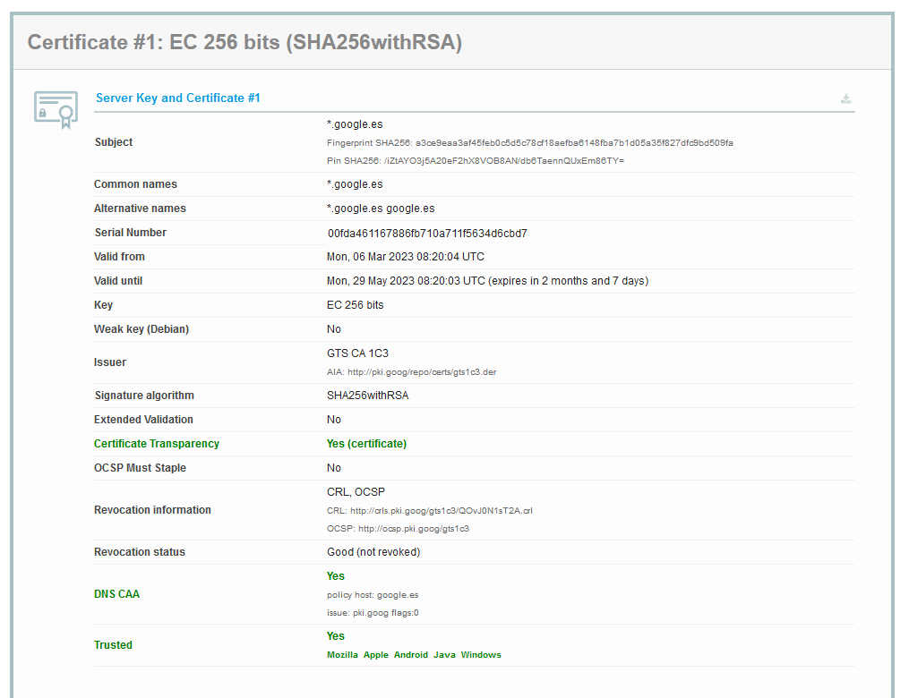

# Análisis de Certificados Verificados y Erróneos

En esta parte del proyecto, analizaré brevemente el certificado de la página web que utilicé en el apartado 2 con SSL Labs.

# Análisis Certificado Google

## Imagen 1 Certificado Google

## Imagen 2 Certificado Google

## Imagen 3 Certificado Google

Como podemos observar en la primera imagen, el certificado de Google cuenta con un certificado de transparencia, lo cual quiere decir que el certificado SSL no contiene fallas estructurales.

Si miramos un poco más abajo en la misma imagen, veremos en el apartado “DNS CAA”, que la autoridad certificadora del dominio es Google y que dicho certificado ha sido verificado por Mozilla, Apple, Android, Java y Windows.

Por último, el certificado está validado por GlobalSign, que son algunos de los certificados raíz más antiguos y confiables del ecosistema PKI.

Después de haber analizado un poco el certificado de Google, se demuestra que este es totalmente válido.

Ahora vamos a analizar de manera muy breve 3 certificados erróneos. Para ello, vamos a buscar 3 webs cuyo certificado no esté validado.

## Imagen 1 Certificado no válido

## Imagen 2 Certificado no válido

## Imagen 3 Certificado no válido

El error de la primera imagen, indica que el certificado no es válido porque este ha caducado. Los certificados tienen una fecha de vencimiento para garantizar que la información que se transmite a través de una conexión segura sigue siendo confiable y segura. Si el certificado ha expirado, significa que ha pasado su fecha de vencimiento y que ya no se puede garantizar la autenticidad y la integridad de la conexión.

Este error se podría solventar obteniendo un nuevo certificado válido y configurarlo correctamente en el servidor web correspondiente.

En el caso de la segunda imagen, el certificado no es válido porque este ha sido revocado. Esto puede suceder por varias razones, como la pérdida o robo de la clave privada del certificado, un error en la emisión del certificado, o si se detecta que el certificado se ha utilizado para fines malintencionados. 

Para poder solventar este error, tendríamos que realizar el mismo proceso que hemos mencionado en el error anterior.

Por último, el error que nos muestra la última imagen, hace que el certificado tampoco sea válido, ya que este error se produce cuando el navegador web o la aplicación no puede verificar la autenticidad del certificado del sitio web utilizando la tecnología de “Cert Pinning” o “Anclaje de Certificados”.

Para poder solventar este error, sería necesario asegurarse de que el sitio web esté utilizando el certificado correcto y autorizado.
