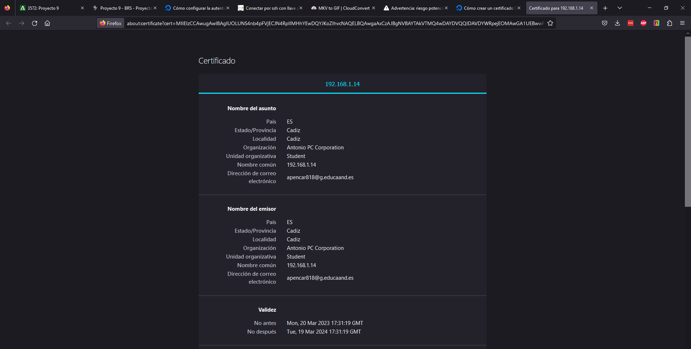
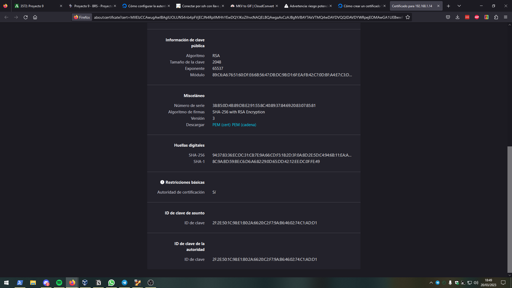
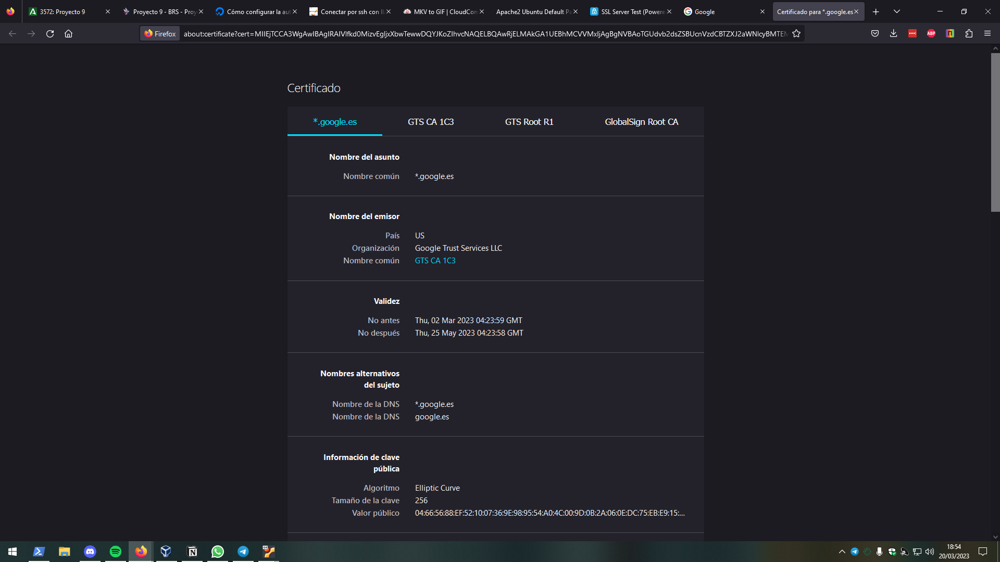
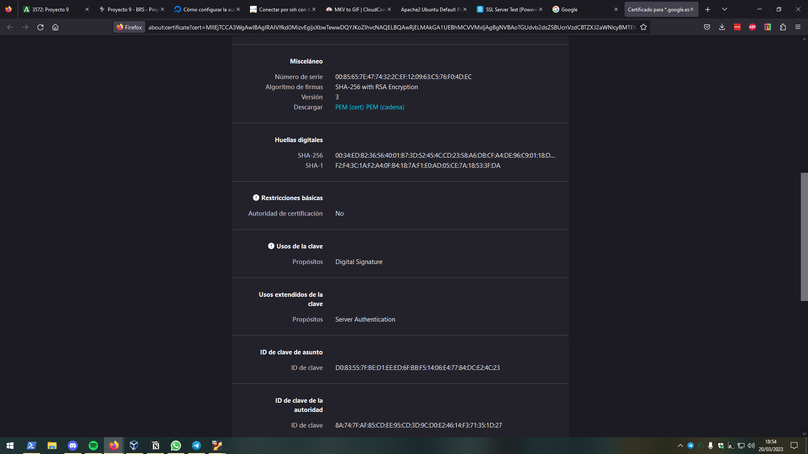
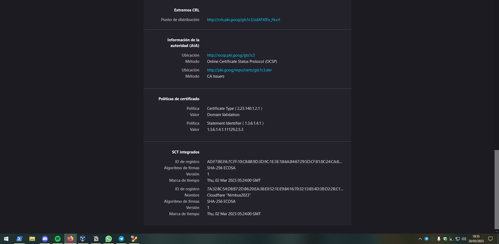

# Comparativa Certificados

En esta parte del proyecto, después de haber implementado el certificado que he creado manualmente en la página de pruebas de Apache2, lo voy a comparar con el certificado de una página oficial como puede ser la de Google.es:

# **Imagen 1 (Certificado propio):**

# Imagen 2 (Certificado propio):

# Imagen 1 (Certificado Google):

# Imagen 2 (Certificado Google):

# Imagen 3 (Certificado Google):

## Diferencias entre certificados (Campos comunes)

- **Nombre del asunto:** Google al ser una empresa oficial y bastante conocida mundialmente, con indicar solamente su nombre de dominio en el asunto, no le hace falta proporcionar más datos. Sin embargo, mi certificado si que contiene bastante información sobre quien lo ha generado (En este caso yo), ya que si este llegase a manos de terceros, la gente tendría que saber de quién y de dónde proviene.
- **Nombre del emisor:** La diferencia más importante en este apartado entre ambos certificados, es que el de Google está expedido por una entidad certificadora propia llamada Google Trust Services, mientras que mi certificado está expedido por mi mismo.
- **Validez:** La validez del certificado de Google será renovada por su propia entidad certificadora, sin embargo, si mi certificado caduca, tendría que volver a generarlo.
- **Información de clave pública:** Esta información, en el caso del certificado de Google, está encriptada con el algoritmo más fuerte en relación a la longitud de la clave (160 bits en el caso de Elliptic Curve), sin embargo, en mi certificado está encriptada con RSA, ya que la longitud de la clave es igual o superior a 1024 bits.
- **Misceláneo:** Ambos certificados utilizan el mismo algoritmo de firmas.
- **Huellas digitales:** Ambos certificados cifran sus huellas digitales con los mismos algoritmos.
- **Restricciones básicas:** Aquí el certificado de Google no tiene ninguna restricción a la hora de ser emitido a un entidad de certificación o a un usuario, equipo, etcétera. Sin embargo, mi certificado si cuenta con dichas restricciones.

## Información extra (Campos no comunes)

Después de la comparativa, he de añadir que el certificado de Google contiene muchas más directivas que refuerzan más su validez a la hora de ser expedido, estas son:

- **Nombres alternativos del sujeto:** Nombres de dominio
- **Usos de la clave:** Propósito principal para el que va a ser utilizado el certificado, en este caso para firmar digitalmente.
- **Esos extendidos de la clave:** Propósito secundario para el que va a ser utilizado el certificado, en este caso para autenticar servidores.
- **ID de clave de asunto**
- **ID de clave de la autoridad:** Clave de la autoridad certificadora
- **Extremos CRL:** Enlace con la lista de revocación de certificados
- I**nformación de la autoridad (AIA)**
- **Políticas de certificado**
- **SCT integrados:** Justificante que indica que el certificado está dado de alta en el registro público.
